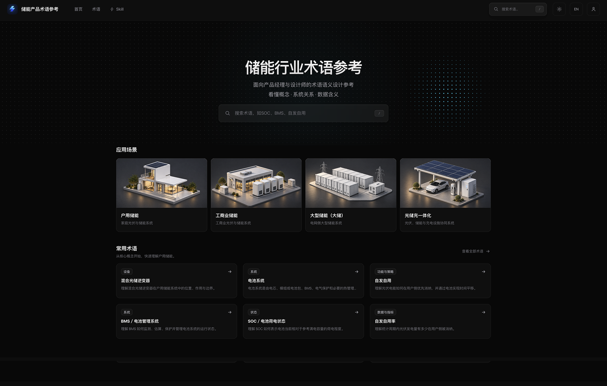

# Energy Storage Vocabulary · 储能行业术语参考

从日常描述找到准确的储能术语，理解概念、系统关系和数据含义。

这个项目面向储能产品经理、设计师和业务人员，帮助你把“电池还有多少电”“停电后还能不能继续供电”这类日常描述，转换成更准确的行业表达；也帮助你分清容易混淆的概念，写出更清晰的需求和 UI 文案。

## 开始使用

| 在线查询 | 安装 Skill |
| --- | --- |
| [打开储能行业术语参考](https://energy.kikoor.com/) | [安装 Energy Storage Vocabulary Skill](#安装与使用) |

## 网站预览

网站提供按应用场景浏览、术语检索和术语详情页。首页从户用储能、工商业储能、大型储能和光储充一体化四个场景开始，也列出常用术语，方便从具体问题进入概念。

<a href="https://energy.kikoor.com/">
  
</a>

## 安装与使用

把这个仓库放到项目的 `.agents/skills/energy-storage-vocabulary/` 目录中，然后在 Codex 中使用 `$energy-storage-vocabulary` 调用：

```text
$energy-storage-vocabulary 经常停电的家庭储能系统应该设计什么工作模式？
```

项目内安装时，完整目录需要一起保留：

```text
.agents/skills/energy-storage-vocabulary/
├── SKILL.md
├── terms-index.md
├── vocabulary.md
└── acceptance.md
```

Skill 会从口语描述定位术语，区分相近概念，并给出更准确的表达、适用场景和来源。它用于术语定位、概念解释和需求表达，不替代工程设计、设备选型、安装调试、安全规范、厂商文档或当地法规。

## Skill

当前提供一个 Skill：

| Skill | 用途 | 文档 |
| --- | --- | --- |
| Energy Storage Vocabulary | 从日常描述找到储能术语，区分相近概念，并改写成准确表达 | [`SKILL.md`](SKILL.md) |

## 内容与方法

- [`terms-index.md`](terms-index.md)：按应用场景和类别组织的术语索引。
- [`vocabulary.md`](vocabulary.md)：网站正式内容的本地快照、版本和参考来源。
- [`acceptance.md`](acceptance.md)：真实问答验收案例，用来检查 Skill 的查词和消歧表现。
- [`check.py`](check.py)：检查术语数量、ID、版本、索引链接、站内路径、本地引用和来源 URL。

术语从具体场景出发组织。遇到相近概念时，Skill 会说明它们的边界、使用条件和统计口径；没有可靠匹配时会明确说明未覆盖或信息不足，不强行编造术语。

术语文件目前是网站内容的本地快照，采用手动更新，不自动同步网站。新增或修改术语后，应同时更新索引和快照，并运行结构检查：

```bash
python3 check.py
```

## 参与和支持

- 发现术语错误或来源问题：提交 [Issue](https://github.com/Kiko-summer/energy-storage-vocabulary/issues)。
- 想补充术语、场景或验收案例：提交 Pull Request，并说明修改依据。
- 遇到 Skill 使用问题：在本仓库反馈，并附上使用的提问和期望结果。
- 遇到网站体验问题：先打开 [在线网站](https://energy.kikoor.com/)，反馈具体页面路径、操作步骤和问题表现。

如果这个项目对你有帮助，欢迎点一个 Star ⭐，也欢迎把网站分享给需要理解储能术语的人。

## 内容边界

当前覆盖户用储能、工商业储能、大型储能和光储充，共 35 条网站正式条目。网站发布或个人审核记录不等于专业认证；厂商用法和地区规则会标明适用范围。

## 许可证与更新

本仓库用于公开 Skill、术语内容、方法说明和用户反馈。修改记录可以在 [commit history](https://github.com/Kiko-summer/energy-storage-vocabulary/commits/main) 中查看。
